# Documentación Técnica UML 2.5+ del Proyecto

## 1. Introducción

El presente documento describe técnicamente un sistema distribuido para gestión de emergencias vehiculares. La solución consolidada integra una arquitectura basada en frontend web, Core backend en FastAPI, microservicios especializados, mensajería asíncrona, almacenamiento de evidencias multimedia, capacidades de inteligencia artificial con fallback controlado, observabilidad, base de despliegue en Kubernetes y validaciones automatizadas con CI/CD.

El objetivo de esta documentación es ofrecer una vista de análisis y diseño con enfoque UML 2.5 o superior, útil en contextos académicos y profesionales. Se busca explicar no solo los componentes implementados, sino también las relaciones, responsabilidades, flujos y decisiones de arquitectura que permiten que el sistema sea mantenible, escalable y listo para evolucionar.

## 2. Alcance del sistema

El sistema cubre los siguientes ámbitos funcionales y técnicos:

- gestión de usuarios
- autenticación JWT
- recuperación segura de contraseña
- gestión de emergencias vehiculares
- integración con microservicio IA
- análisis de texto, imagen y audio
- almacenamiento de evidencias
- mensajería asíncrona
- observabilidad
- preparación Kubernetes
- validación CI/CD

En términos arquitectónicos, el sistema ya no se limita a un backend monolítico. En cambio, adopta una composición por capas y servicios que permite separar responsabilidades entre lógica central, procesamiento multimedia, infraestructura de integración y mecanismos de monitoreo.

## 3. Tecnologías utilizadas

| Área | Tecnología | Rol dentro del sistema |
|---|---|---|
| Frontend | Angular / Node.js | Interfaz de usuario y capa de presentación |
| Backend Core | FastAPI | Lógica principal del negocio, autenticación e integración |
| Base de datos | PostgreSQL | Persistencia principal del Core |
| Contenedores | Docker Compose | Orquestación local de servicios |
| Mensajería | RabbitMQ | Comunicación asíncrona entre Core y MS IA |
| Almacenamiento | MinIO / S3 compatible | Evidencias multimedia |
| MS IA | Node.js + TypeScript + Express | Procesamiento multimedia especializado |
| IA externa | OpenAI / fallback | Análisis avanzado de texto, imagen y audio |
| Métricas | Prometheus | Recolección de métricas técnicas |
| Visualización | Grafana | Observabilidad y dashboards |
| Orquestación futura | Kubernetes | Base de despliegue local con manifests |
| Automatización | GitHub Actions | Validaciones CI/CD |

## 4. Norma UML utilizada

La presente documentación utiliza una interpretación compatible con UML 2.5 o superior. Esto implica los siguientes criterios:

- Los diagramas siguen conceptos estándar de UML 2.5+.
- Los modelos presentados son modelos de análisis y diseño, no una transcripción literal del código fuente.
- Los diagramas están redactados para poder trasladarse a herramientas como Enterprise Architect, StarUML, Visual Paradigm o PlantUML.
- Se emplea PlantUML como notación textual de apoyo, manteniendo estructura conceptual alineada con UML moderno.

La finalidad no es producir diagramas excesivamente dependientes de una implementación específica, sino representar de forma clara los elementos principales del sistema y sus interacciones.

## 5. Vista de casos de uso

### 5.1 Actores

Los actores identificados en el modelo son:

- Usuario
- Administrador
- Cliente
- Taller
- Técnico
- Sistema Core
- Microservicio IA
- RabbitMQ
- MinIO
- Prometheus

Observación técnica:

- `Usuario` actúa como actor general abstracto del cual pueden derivarse roles como `Cliente`, `Taller`, `Técnico` y `Administrador`.
- Algunos actores representan sistemas externos o subsistemas relevantes desde el punto de vista de interacción, como `RabbitMQ`, `MinIO` y `Prometheus`.

### 5.2 Casos de uso principales

| Caso de uso | Actor principal | Propósito |
|---|---|---|
| Iniciar sesión | Usuario | Obtener autenticación mediante JWT |
| Recuperar contraseña | Usuario | Solicitar y ejecutar recuperación segura de acceso |
| Consultar perfil autenticado | Usuario | Ver datos del usuario autenticado |
| Registrar emergencia | Cliente | Generar una emergencia vehicular o contexto asociado |
| Enviar emergencia a IA | Sistema Core | Invocar análisis HTTP contra MS IA |
| Publicar análisis en cola | Sistema Core | Publicar un evento en RabbitMQ |
| Consumir mensaje de RabbitMQ | Microservicio IA | Procesar mensajes de análisis asíncrono |
| Subir evidencia | Usuario / MS IA | Enviar archivo y almacenarlo en MinIO |
| Analizar texto | Microservicio IA | Analizar descripción de emergencia |
| Analizar imagen | Microservicio IA | Procesar imagen con fallback o IA externa |
| Analizar audio | Microservicio IA | Procesar audio con fallback o IA externa |
| Consultar métricas | Prometheus / Administrador | Revisar estado y métricas técnicas |
| Validar despliegue | GitHub Actions / Equipo técnico | Verificar integridad técnica del sistema |

### 5.3 Diagrama de casos de uso en PlantUML

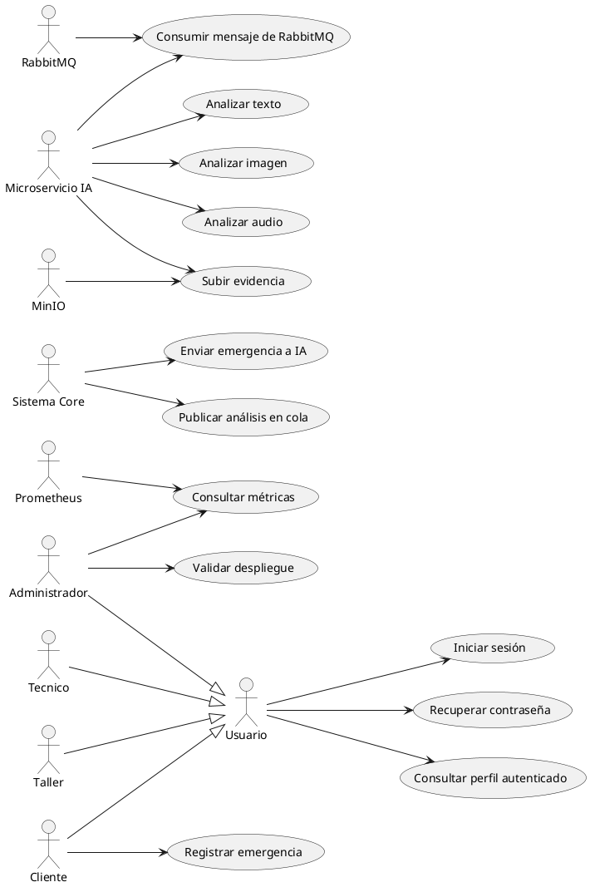

## 6. Vista lógica / Modelo conceptual de clases

### 6.1 Clases principales

Se identifican las siguientes clases conceptuales:

- `Usuario`
  Representa una entidad autenticable con información base y credenciales.

- `Cliente`
  Especialización de `Usuario` asociada a la generación o seguimiento de emergencias.

- `Taller`
  Especialización de `Usuario` asociada a atención técnica u operativa.

- `Técnico`
  Especialización de `Usuario` asociada a operación técnica.

- `Emergencia`
  Representa el evento o solicitud vehicular a tratar dentro del sistema.

- `Evidencia`
  Representa un archivo multimedia vinculado conceptualmente a una emergencia.

- `AnalisisIA`
  Resultado estructurado generado por el microservicio de IA.

- `TokenRecuperacion`
  Modelo conceptual del token usado en recuperación segura de contraseña.

- `MensajeAnalisis`
  Representa la carga lógica publicada en RabbitMQ para análisis diferido.

- `MetricaServicio`
  Modelo conceptual de información observada por Prometheus.

### 6.2 Relaciones

Las relaciones conceptuales principales son:

- `Usuario` generaliza roles.
- `Cliente` reporta `Emergencia`.
- `Emergencia` tiene `Evidencia`.
- `Emergencia` genera `MensajeAnalisis`.
- `MS IA` genera `AnalisisIA`.
- `Evidencia` se almacena en MinIO.
- `TokenRecuperacion` pertenece a `Usuario`.

Desde un punto de vista de diseño, estas relaciones no implican que toda clase exista con exactamente ese nombre en el código. Se trata de un modelo conceptual de negocio y arquitectura.

### 6.3 Diagrama de clases PlantUML

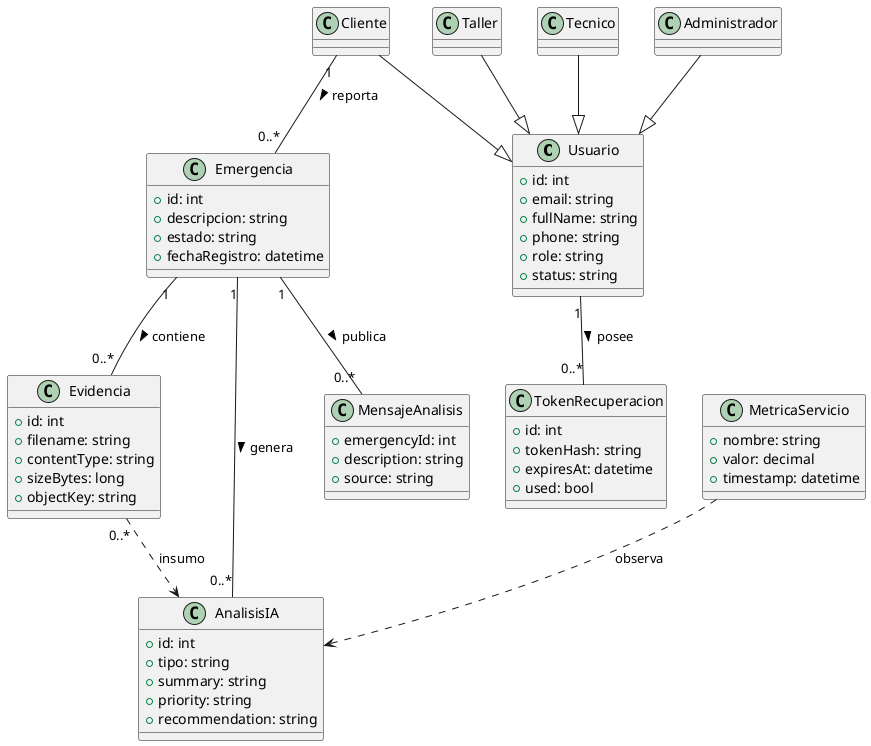

## 7. Vista de componentes

### 7.1 Componentes

Los componentes principales identificados son:

- `Frontend`
- `API Gateway`
- `Core FastAPI`
- `PostgreSQL`
- `RabbitMQ`
- `MinIO`
- `MS IA Multimedia`
- `MS Seguimiento Automatización`
- `Prometheus`
- `Grafana`
- `GitHub Actions`
- `Kubernetes Manifests`

Cada uno cumple una responsabilidad distinta:

- el `Frontend` consume servicios
- el `Gateway` centraliza rutas
- el `Core` concentra negocio e integración
- `PostgreSQL` persiste datos principales
- `RabbitMQ` desacopla procesos
- `MinIO` gestiona objetos multimedia
- `MS IA Multimedia` procesa análisis especializados
- `MS Seguimiento Automatización` prepara una segunda capacidad de dominio
- `Prometheus` y `Grafana` cubren observabilidad
- `GitHub Actions` y `Kubernetes Manifests` soportan la operación técnica

### 7.2 Diagrama de componentes PlantUML

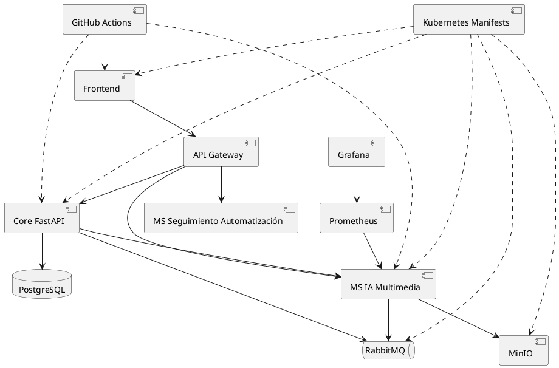

## 8. Vista de despliegue

### 8.1 Nodos

Los nodos lógicos y físicos de despliegue local son:

- Host Docker local
- Contenedor Frontend
- Contenedor Core
- Contenedor PostgreSQL
- Contenedor RabbitMQ
- Contenedor MinIO
- Contenedor MS IA
- Contenedor Gateway
- Contenedor Prometheus
- Contenedor Grafana

El modelo de despliegue actual se enfoca en ejecución local dockerizada, no en cloud productivo.

### 8.2 Puertos

| Componente | Puerto |
|---|---|
| Frontend | 5656 |
| Core | 8787 |
| MS IA | 8090 |
| Gateway | 8088 |
| RabbitMQ | 5672 / 15672 |
| MinIO | 9000 / 9001 |
| Prometheus | 9090 |
| Grafana | 3006 |
| PostgreSQL | 5432 |

### 8.3 Diagrama de despliegue PlantUML

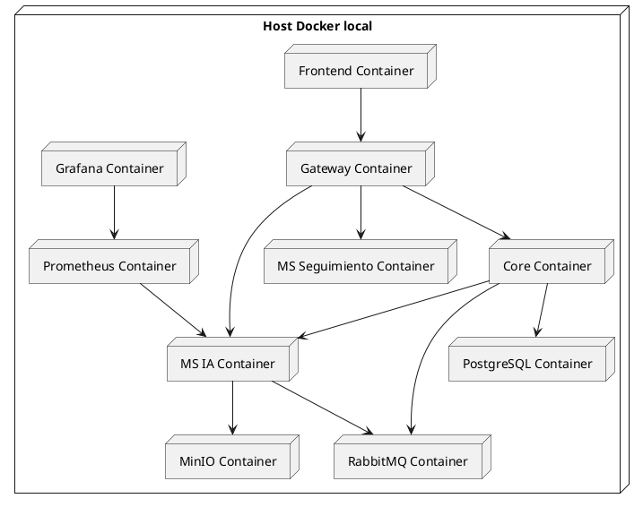

## 9. Vista de secuencia

### 9.1 Login JWT

Descripción:

El usuario envía credenciales a través del frontend. El Core valida usuario y contraseña, consulta persistencia y devuelve un token JWT para uso posterior.

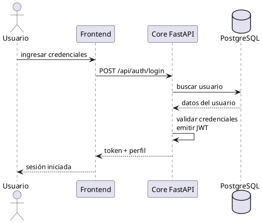

### 9.2 Recuperación de contraseña segura

Descripción:

El flujo genera un token temporal hasheado. El sistema no almacena el token plano. Posteriormente, el usuario utiliza el token recibido para definir una nueva contraseña.

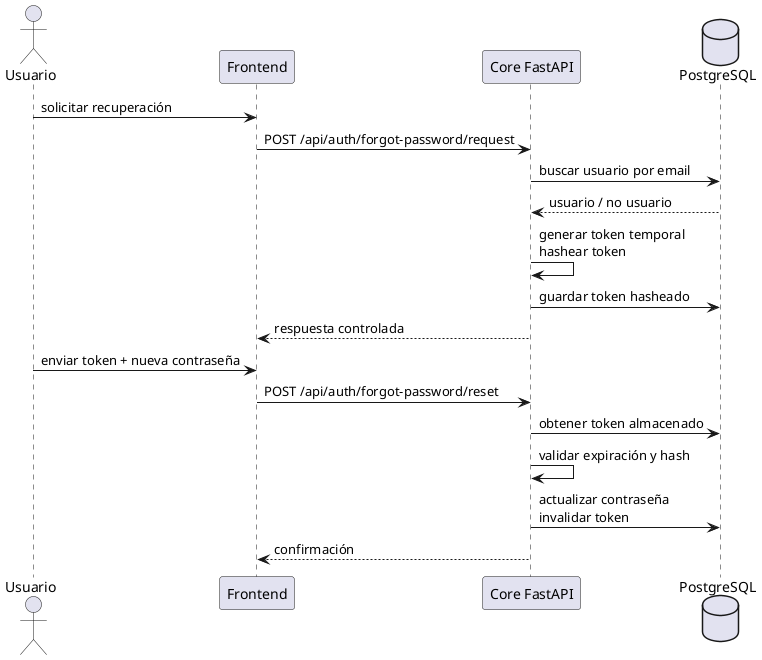

### 9.3 Core hacia MS IA por HTTP

Descripción:

El Core invoca directamente al microservicio IA mediante un endpoint de integración HTTP.

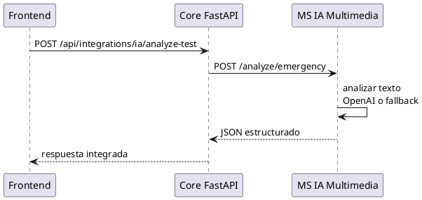

### 9.4 Core hacia RabbitMQ y consumo IA

Descripción:

El Core publica un evento en la cola y el MS IA Multimedia lo consume de forma desacoplada.

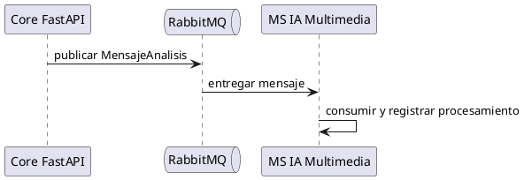

### 9.5 Upload de evidencia a MinIO

Descripción:

El archivo es enviado al microservicio IA, el cual construye metadatos y lo almacena en MinIO.

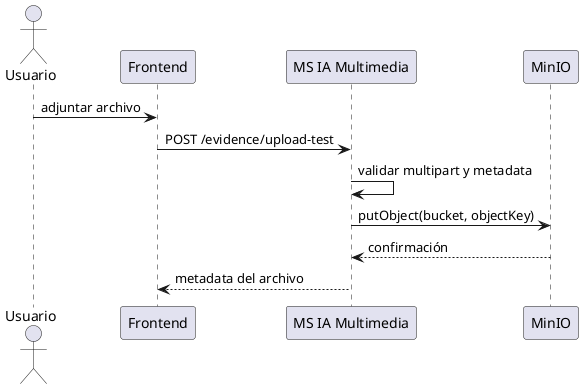

### 9.6 Análisis de imagen

Descripción:

El microservicio recibe una imagen, valida tipo y tamaño, y luego deriva el análisis a IA externa o fallback.

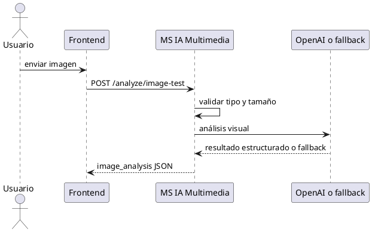

### 9.7 Análisis de audio

Descripción:

El microservicio recibe audio, valida formato permitido y devuelve transcripción y análisis estructurado.

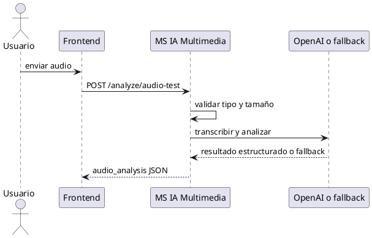

## 10. Vista de actividad

### 10.1 Flujo de recuperación de contraseña

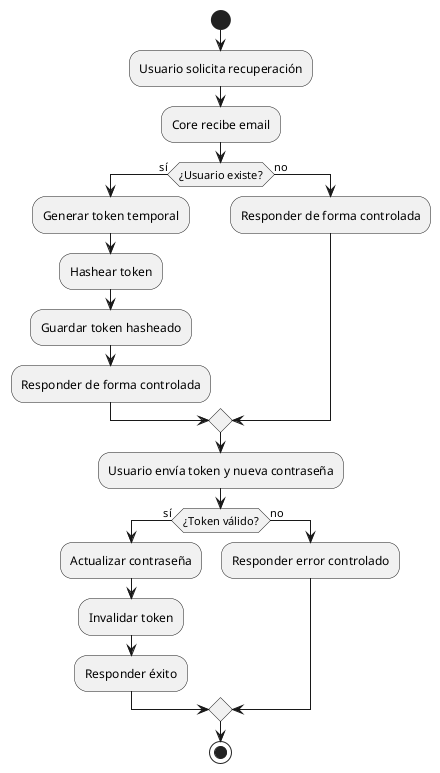

### 10.2 Flujo de análisis multimedia

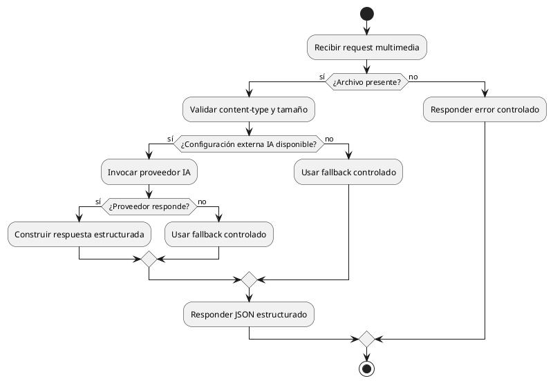

### 10.3 Flujo de publicación y consumo RabbitMQ

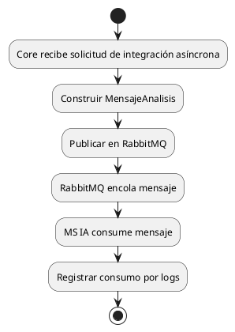

## 11. Vista de paquetes

La organización general del sistema puede interpretarse en paquetes lógicos:

- `backend/app/api`
- `backend/app/core`
- `backend/app/db`
- `services/ms-ia-multimedia`
- `services/ms-seguimiento-automatizacion`
- `gateway`
- `observability`
- `k8s`
- `.github/workflows`

Esta distribución favorece separación entre lógica de negocio, adaptadores técnicos, infraestructura de despliegue y automatización.

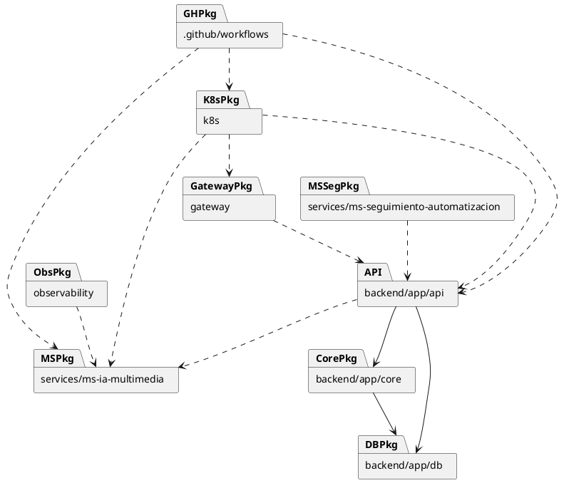

## 12. Vista de datos

El modelo de datos del sistema debe entenderse como conceptual. No se documentan tablas físicas exactas no confirmadas en detalle, pero sí las entidades principales y su propósito:

- usuarios / clientes / talleres / técnicos
- emergencias
- evidencias
- tokens de recuperación
- mensajes RabbitMQ
- objetos MinIO
- métricas Prometheus

Interpretación conceptual:

- los usuarios constituyen la base de autenticación y autorización
- las emergencias representan el centro del dominio
- las evidencias almacenan contexto multimedia
- los tokens de recuperación soportan seguridad de acceso
- los mensajes de RabbitMQ representan integración asíncrona
- los objetos en MinIO representan evidencia persistida como archivos
- las métricas Prometheus permiten visibilidad operativa

## 13. Seguridad

Los mecanismos principales de seguridad identificados son:

- autenticación mediante JWT
- endpoints protegidos
- forgot-password seguro
- token temporal hasheado
- no se almacenan tokens planos
- no se suben secretos reales
- placeholders en `k8s`
- fallback IA sin exponer claves

Desde el punto de vista de diseño, la seguridad se distribuye entre:

- validación de credenciales en el Core
- protección de endpoints según autenticación
- manejo seguro de recuperación de contraseña
- separación entre configuración sensible y valores de ejemplo
- protección de claves externas al no exponerlas en respuestas

## 14. Observabilidad

La observabilidad implementada es básica pero funcional:

- `MS IA` expone `/metrics`
- Prometheus scrapea `ms-ia-multimedia`
- Grafana visualiza métricas
- targets `UP` validados

Esto permite demostrar:

- disponibilidad del microservicio
- instrumentación técnica
- base para monitoreo posterior más avanzado

## 15. CI/CD

La automatización técnica está compuesta por dos workflows principales:

- `ci.yml`
  Valida Python, frontend, `ms-ia-multimedia`, YAML y Kubernetes.

- `docker-config.yml`
  Valida `docker compose config` sobre los archivos Compose existentes.

Características importantes:

- no hace deploy cloud
- no publica imágenes
- no depende de secretos reales
- incluye preparación de placeholders temporales para validación segura

## 16. Kubernetes

La carpeta `k8s/` contiene manifests básicos para despliegue local:

- namespace `ficct-emergencias`
- deployments y services
- secrets de ejemplo
- imágenes propias como placeholders locales

Limitaciones actuales:

- no incluye Helm
- no incluye TLS
- no incluye cloud real
- no representa todavía un despliegue productivo completo

Sin embargo, la existencia de esta estructura permite afirmar que el sistema ya tiene una base de portabilidad hacia un entorno orquestado.

## 17. Validaciones finales

- `py_compile OK`
- `docker compose config OK`
- `K8S_YAML_OK`
- `WORKFLOWS_YAML_OK`
- `Backend health OK`
- `Frontend OK`
- `MS IA health OK`
- `RabbitMQ consumer OK`
- `MinIO upload OK`
- `Image-test OK`
- `Audio-test OK`
- `Prometheus targets UP`

## 18. Limitaciones

El sistema consolidado todavía presenta algunas limitaciones deliberadas:

- no despliegue cloud real
- no Helm
- no Terraform
- no TLS
- no secretos reales
- IA real depende de `OPENAI_API_KEY`
- algunos endpoints son de prueba / integración

Estas limitaciones no invalidan la arquitectura. Al contrario, ayudan a delimitar el alcance real del proyecto y separan claramente lo implementado de lo proyectado para evolución futura.

## 19. Conclusión

En conclusión, el sistema representa una base distribuida, modular y cloud-ready. Integra componentes de negocio, mensajería, almacenamiento, IA, observabilidad, automatización y preparación de despliegue, manteniendo una separación clara de responsabilidades.

Desde una perspectiva UML 2.5+, la arquitectura puede modelarse coherentemente a través de vistas de casos de uso, clases conceptuales, componentes, despliegue, secuencia, actividades y paquetes. Esto convierte al proyecto en una base sólida tanto para exposición académica como para evolución técnica hacia escenarios de mayor complejidad.
