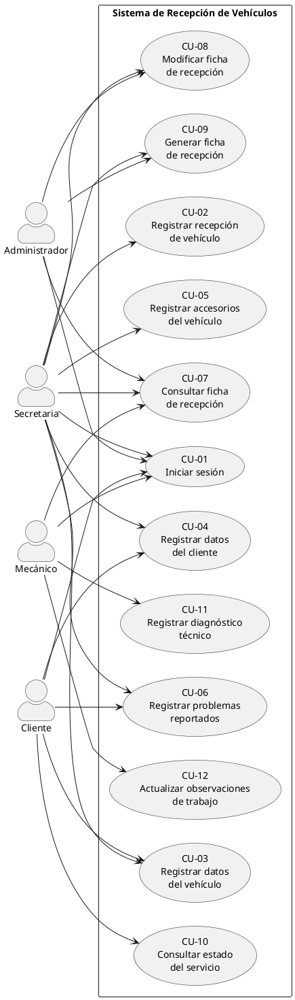
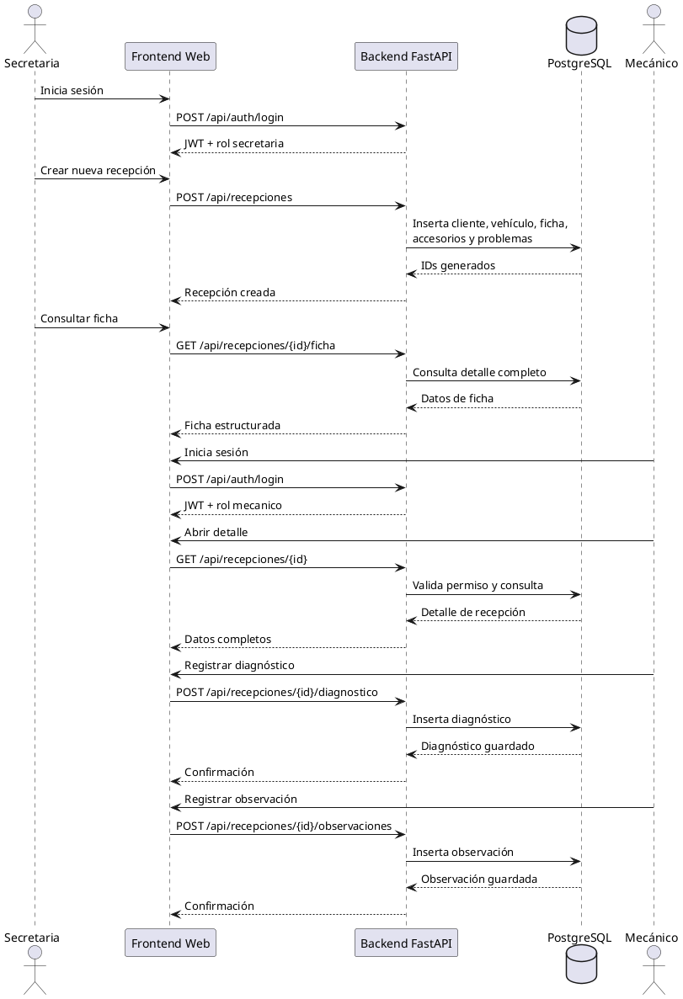

# Sistema de Recepción de Vehículos

## 1. Objetivo del módulo

El módulo **Sistema de Recepción de Vehículos** permite registrar, consultar y dar seguimiento al ingreso de vehículos a taller dentro del sistema web del proyecto **FICCT-Segundo-Parcial-Sw2-Web**.

Su propósito es cubrir el flujo básico del negocio de taller mecánico desde la recepción inicial hasta el trabajo técnico, manteniendo separada esta funcionalidad del flujo de emergencias vehiculares ya existente.

## 2. Actores

### Web

- **Administrador**
- **Secretaria**
- **Mecánico**

### Móvil / API

- **Cliente**

## 3. Casos de uso implementados

- **CU-01** Iniciar sesión
- **CU-02** Registrar recepción de vehículo
- **CU-03** Registrar datos del vehículo
- **CU-04** Registrar datos del cliente
- **CU-05** Registrar accesorios del vehículo
- **CU-06** Registrar problemas reportados
- **CU-07** Consultar ficha de recepción
- **CU-08** Modificar ficha de recepción
- **CU-09** Generar ficha de recepción
- **CU-10** Consultar estado del servicio
- **CU-11** Registrar diagnóstico técnico
- **CU-12** Actualizar observaciones de trabajo

## 4. Roles y permisos

### Administrador

- Inicia sesión como `admin`.
- Consulta fichas de recepción.
- Modifica fichas de recepción.
- Visualiza ficha estructurada para revisión o impresión.
- Supervisa el estado general del módulo.

### Secretaria

- Inicia sesión como rol operativo.
- Registra recepciones.
- Registra cliente, vehículo, accesorios y problemas reportados.
- Modifica fichas de recepción.
- Consulta fichas.
- Genera ficha de recepción.

### Mecánico

- Inicia sesión como rol operativo.
- Consulta recepciones visibles para su usuario.
- Registra diagnóstico técnico.
- Registra observaciones de trabajo.
- Consulta detalle y estado del servicio.

### Cliente

- Inicia sesión o se identifica desde el flujo móvil/API.
- Consulta el estado del servicio cuando la ficha está vinculada mediante `mobile_client_id`.

## 5. Tablas creadas

El módulo utiliza tablas propias en PostgreSQL para mantener independencia respecto al dominio principal de emergencias:

- `clientes_recepcion`
- `vehiculos_recepcion`
- `fichas_recepcion`
- `accesorios_recepcion`
- `problemas_recepcion`
- `diagnosticos_recepcion`
- `observaciones_recepcion`

### Resumen funcional de cada tabla

- `clientes_recepcion`: almacena los datos de cliente usados en la ficha de recepción.
- `vehiculos_recepcion`: almacena los datos del vehículo asociados a un cliente de recepción.
- `fichas_recepcion`: representa la ficha principal del proceso de taller.
- `accesorios_recepcion`: registra accesorios o elementos entregados con el vehículo.
- `problemas_recepcion`: almacena los problemas reportados al momento del ingreso.
- `diagnosticos_recepcion`: guarda el diagnóstico técnico registrado por el mecánico.
- `observaciones_recepcion`: guarda observaciones de trabajo y estado operativo.

## 6. Endpoints del backend

Base backend local:

- `http://localhost:8787`

### Autenticación

- `POST /api/auth/login`

### Recepciones

- `POST /api/recepciones`
- `GET /api/recepciones`
- `GET /api/recepciones/{id}`
- `PUT /api/recepciones/{id}`
- `GET /api/recepciones/{id}/ficha`
- `POST /api/recepciones/{id}/diagnostico`
- `POST /api/recepciones/{id}/observaciones`
- `GET /api/recepciones/{id}/estado`

### Permisos por endpoint

- `POST /api/recepciones`: `secretaria`
- `GET /api/recepciones`: `admin`, `secretaria`, `mecanico`
- `GET /api/recepciones/{id}`: `admin`, `secretaria`, `mecanico`, `client` propietario
- `PUT /api/recepciones/{id}`: `admin`, `secretaria`
- `GET /api/recepciones/{id}/ficha`: `admin`, `secretaria`, `mecanico`
- `POST /api/recepciones/{id}/diagnostico`: `mecanico`
- `POST /api/recepciones/{id}/observaciones`: `mecanico`
- `GET /api/recepciones/{id}/estado`: `admin`, `secretaria`, `mecanico`, `client` propietario

### Regla de pertenencia para cliente

El acceso del rol `client` al detalle o estado se valida con:

- `clientes_recepcion.mobile_client_id = current_user.id`

### Filtros del listado

`GET /api/recepciones` soporta:

- `status`
- `plate`
- `codigo_ficha`
- `identity_card`
- `assigned_mechanic_id`
- `limit` con valor por defecto `20` y máximo `100`
- `offset` con valor por defecto `0`

## 7. Rutas del frontend

Base frontend local:

- `http://localhost:5656`

Rutas implementadas:

- `/login`
- `/dashboard`
- `/recepciones`
- `/recepciones/nueva`
- `/recepciones/:id`
- `/recepciones/:id/editar`
- `/recepciones/:id/diagnostico`
- `/recepciones/:id/observaciones`

### Pantallas incorporadas

- Listado de recepciones
- Formulario de nueva recepción
- Formulario de edición de recepción
- Detalle / ficha de recepción
- Pantalla de diagnóstico técnico
- Pantalla de observaciones de trabajo

## 8. Credenciales de prueba

### Administrador

- `administrador@acb.com`
- `123ppp+++`

### Secretaria

- `secretaria@acb.com`
- `secretaria123`

### Mecánico

- `mecanico@acb.com`
- `mecanico123`

## 9. Flujo de demostración

### Flujo 1: Secretaria

1. Ingresar a `http://localhost:5656/login`.
2. Seleccionar **Operador de sucursal**.
3. Iniciar sesión con `secretaria@acb.com / secretaria123`.
4. Entrar al módulo **Recepción de Vehículos** desde el dashboard.
5. Crear una nueva recepción.
6. Registrar datos del cliente.
7. Registrar datos del vehículo.
8. Registrar accesorios y problemas reportados.
9. Guardar la ficha.
10. Consultar el detalle o la ficha generada.
11. Editar la recepción si es necesario.

### Flujo 2: Mecánico

1. Cerrar sesión.
2. Seleccionar **Operador de sucursal**.
3. Iniciar sesión con `mecanico@acb.com / mecanico123`.
4. Abrir el módulo **Recepción de Vehículos**.
5. Consultar recepciones visibles para su usuario.
6. Abrir el detalle de una ficha.
7. Registrar diagnóstico técnico.
8. Registrar observaciones de trabajo.

### Flujo 3: Administrador

1. Cerrar sesión.
2. Seleccionar **Administrador**.
3. Iniciar sesión con `administrador@acb.com / 123ppp+++`.
4. Acceder al dashboard.
5. Consultar la lista de recepciones.
6. Abrir una ficha para revisión o impresión.

## 10. Validaciones realizadas

Durante la implementación e integración del módulo se validó:

- Compilación del backend con `py_compile`.
- Creación de tablas del módulo en PostgreSQL.
- Disponibilidad del backend mediante `GET /api/health`.
- Construcción del frontend Angular con `npm run build`.
- Login funcional para:
  - `admin`
  - `secretaria`
  - `mecanico`
- Registro de recepción por rol `secretaria`.
- Registro de diagnóstico y observaciones por rol `mecanico`.
- Restricciones de acceso por rol en endpoints y frontend.
- Filtros y paginación del listado de recepciones.

## 11. Limitaciones

- El cliente móvil/API no tiene en este repositorio una interfaz móvil nativa separada; su interacción depende del backend y del vínculo `mobile_client_id`.
- El módulo se centra en la recepción y seguimiento básico, no en facturación ni cierre comercial del servicio.
- La ficha se maneja como vista estructurada y utilizable para impresión desde frontend; no se generó un motor PDF dedicado.
- El esquema de base de datos se inicializa desde la lógica del proyecto y no mediante migraciones formales como Alembic.
- El rol `workshop` se mantiene por compatibilidad con partes previas del sistema, aunque el módulo se apoya operativamente en `secretaria` y `mecanico`.

## 12. Diagrama PlantUML de casos de uso

## 13. Diagrama PlantUML de flujo Secretaria → Recepción → Mecánico

## 14. Conclusión

El módulo **Sistema de Recepción de Vehículos** quedó integrado sobre la arquitectura existente del proyecto con backend FastAPI, frontend Angular y PostgreSQL, sin afectar los microservicios ni el resto de la plataforma.

La solución implementa un flujo básico, claro y funcional para recepción de vehículos, seguimiento técnico y consulta de estado, con separación por roles y una base sólida para futuras extensiones como cierre de órdenes, presupuesto, historial mecánico o generación avanzada de documentos.
